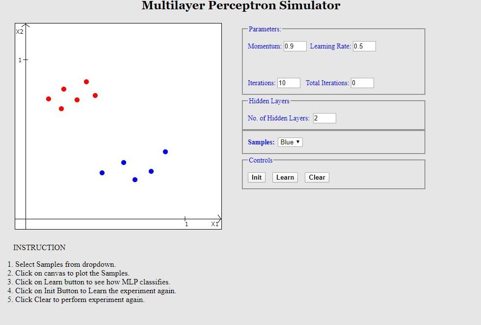
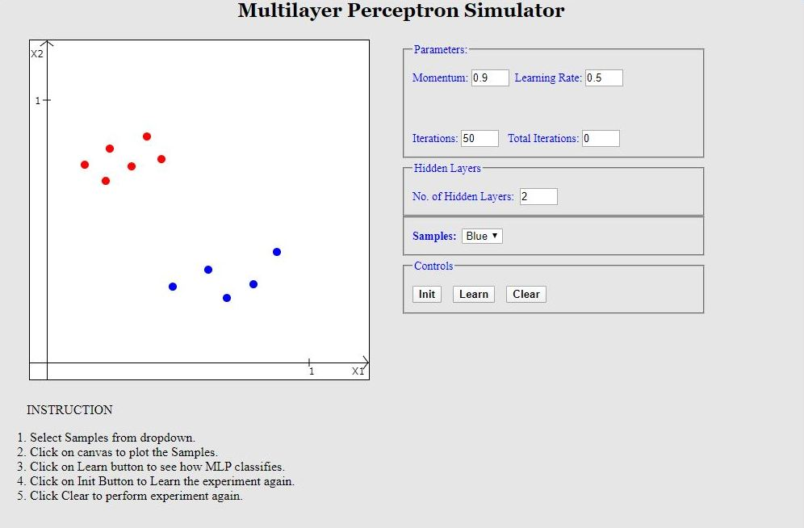
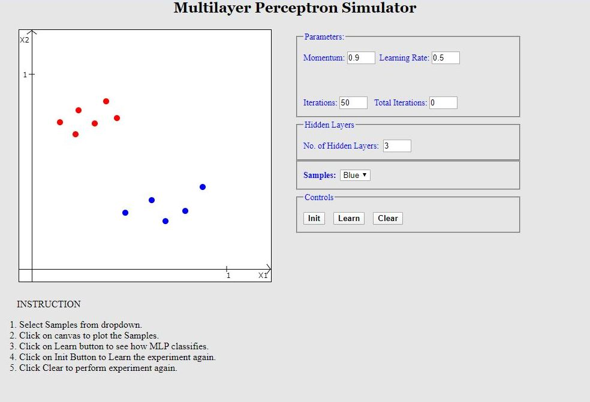
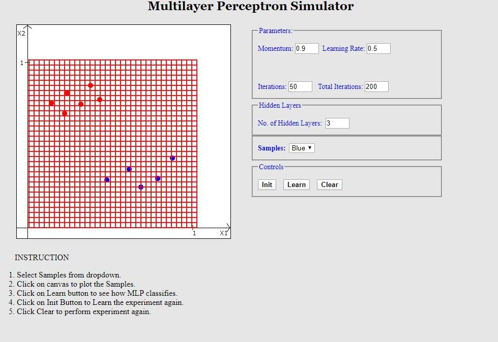
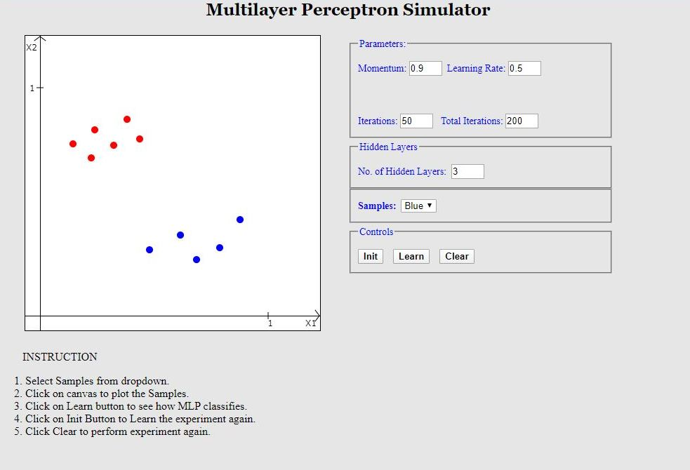
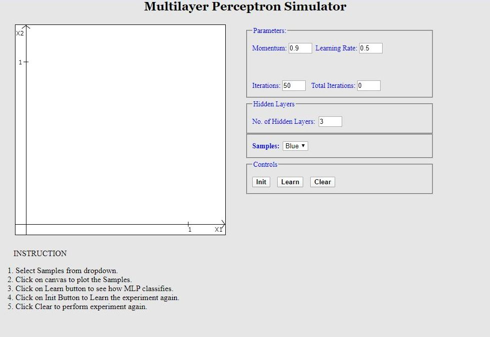

# Procedure

Select Samples from dropdown and click on the board to plot samples.

Change values in the Parameters section.

Input no. of Hidden Layers in the Hidden Layers section.

Click on Learn to see how MLP classifies the inputs you supplied.

Click on Init Button to Restart the experiment from 1st Iteration.

Click on Clear Button to Perform the experiment again.

