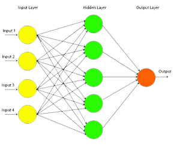

# Introduction
The Multi-Layer-Perceptron was first introduced by M. Minsky and S. Papert in 1969. It is an extended Perceptron and has one ore more hidden neuron layers between its input and output layers. Due to its extended structure, a Multi-Layer-Perceptron is able to solve every logical operation, including the XOR problem.

Multilayer perceptrons (MLPs) are feedforward neural networks trained with the standard backpropagation algorithm. They are supervised networks so they require a desired response to be trained. They learn how to transform input data into a desired response, so they are widely used for pattern classification. With one or two hidden layers, they can approximate virtually any input-output map. They have been shown to approximate the performance of optimal statistical classifiers in difficult problems. Most neural network applications involve MLPs.

***Fig. 1: Multi-layer Perceptron***

# Theory

## Multi-layer Perceptron

This network was introduced around 1986 with the advent of the back-propagation algorithm. Until then there was no rule via which we could train neural networks with more than one layer. As the name implies, a Multi-layer Perceptron is just that, a network that is comprised of many neurons, divided in layers. These layers are divided as follows:

- The input layer, where the input of the network goes. The number of neurons here depends on the number of inputs we want our network to get.
- One or more hidden layers. These layers come between the input and the output and their number can vary. The function that the hidden layer serves is to encode the input and map it to the output. It has been proven that a multi-layer perceptron with only one hidden layer can approximate any function that connects its input with its outputs if such a function exists.
- The output layer, where the outcome of the network can be seen. The number of neurons here depends on the problem we want the neural net to learn.
 
The Multi-layer perceptron differs from the simple perceptron in many ways. The same part is that of weight randomization. All weights are given random values between a certain range, usually [-0.5,0.5]. Having that aside though, for each pattern that is fed to the network three passes over the net are made.